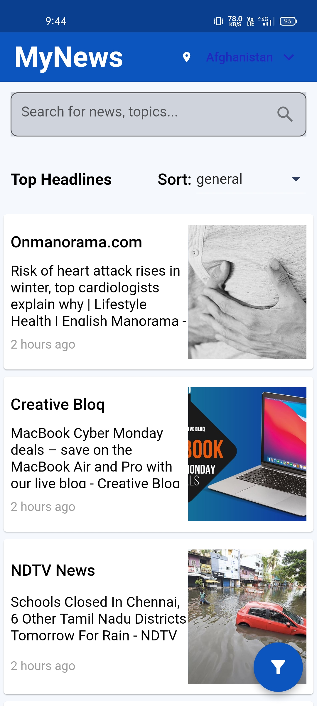
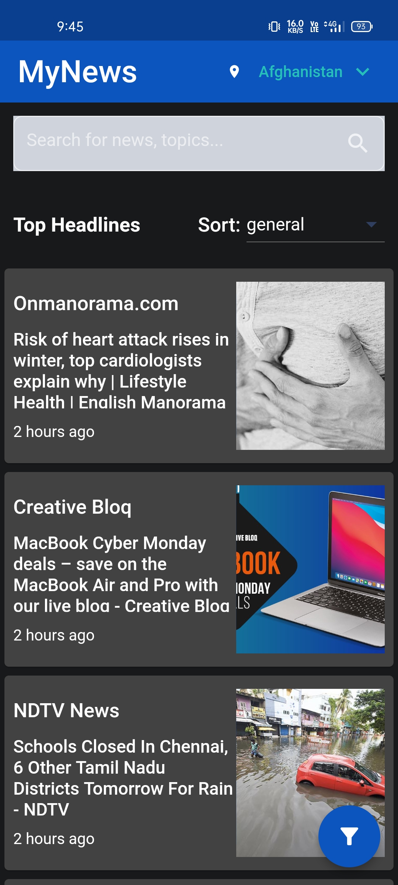
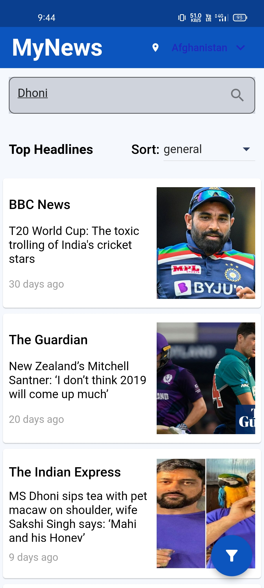
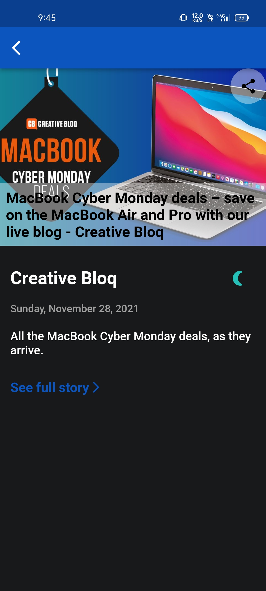
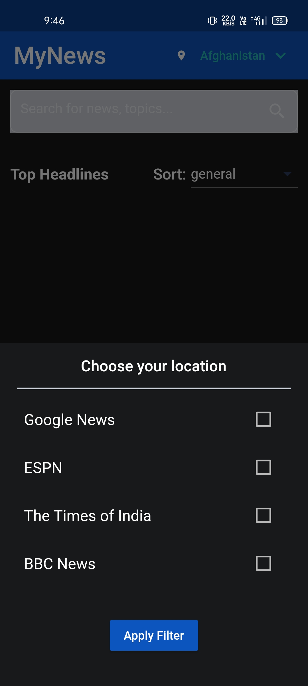
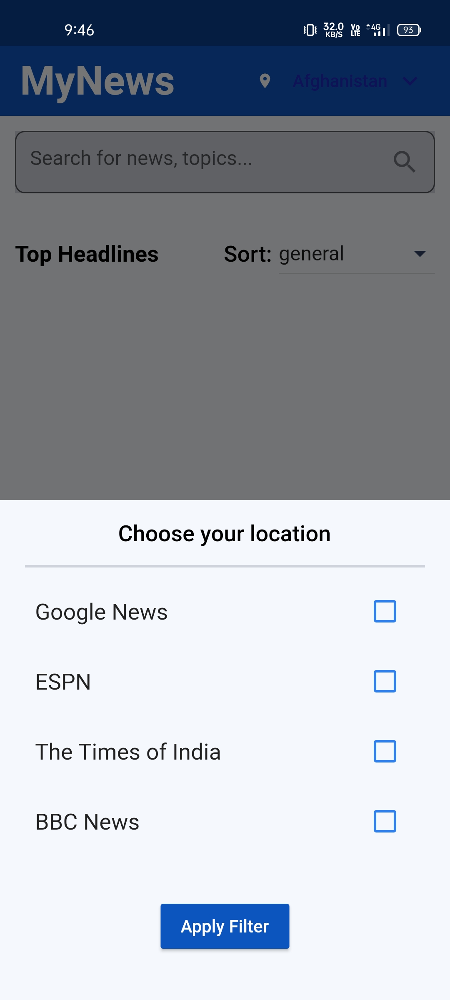

# MyNews

My News will keep you updated with the latest news.

 

The [News API](https://newsapi.org/) was used to fetch the latest news.  
 

  Please star⭐ the repo if you like what you see😉.

## 💻 Requirements

- Any Operating System (ie. MacOS X, Linux, Windows)
- Any IDE with Flutter SDK installed (ie. IntelliJ, Android Studio, VSCode etc)
- A little knowledge of Dart and Flutter

## ✨ Features

- [x] See all latest news.
- [x] Filter news according to news source ex- google news, bbc, cnn etc.
- [x] Show top headlines according to users location. 
- [x] Search any keywords or news.
- [x] Internet Connect error handling.
- [x] Pull to refresh feature.  
- [x] User friendly UI.
- [x] Dark Mode.
- [x] Clean Architecture.   

## 📸 ScreenShots

<!--  -->

| Light                             | Dark                              |
| --------------------------------- | --------------------------------- |
|   |   |
|   |   |
|   |   |
|   
<!-- |   |   |
|   |   | -->

